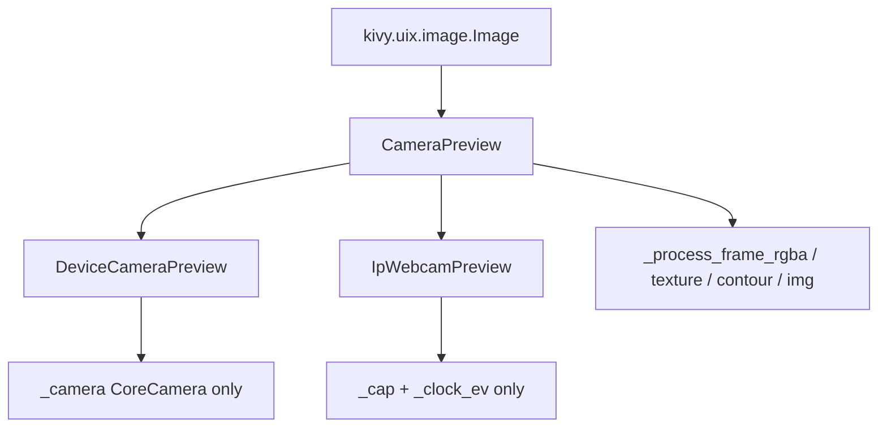

# Camera preview rename and parent split

## Goal

Reduce visual clutter in [`widgets/camera.py`](widgets/camera.py): today one class holds both `_camera` and `_cap` even though only one is live. Rename away from `KivyCamera`, introduce a **parent** that owns shared preview/detection logic, and give each source its own subclass with a single capture handle.

This is a **dedicated refactor** (separate from vision Phase 2 geometry/grid-score). Do not mix it into the same commit as detection accuracy changes.

## Target shape



### Naming

| Old            | New                                          |
| -------------- | -------------------------------------------- |
| `KivyCamera`   | **`CameraPreview`** (base, inherits `Image`) |
| Android path   | **`DeviceCameraPreview`**                    |
| IP webcam path | **`IpWebcamPreview`**                        |

Public screen API stays: `start_capture()`, `stop_capture()`, `img`, plus existing Kivy properties where needed (`play`, `index`, `resolution` on the device subclass).

### Parent: `CameraPreview(Image)`

Owns only shared preview state and behavior:

- `img`, `_last_contour`, `_next_detect_at`, `_preview_texture`
- `_process_frame_rgba`, `_ensure_preview_texture`, highlight drawing
- `start_capture` / `stop_capture` as template methods that call subclass hooks, then clear shared state
- **No** `_camera`, **no** `_cap`

Subclass hooks:

- `_open_capture()` — open the backend; set `play`
- `_close_capture()` — release only that backend’s resources

### `DeviceCameraPreview(CameraPreview)`

- Fields: `_camera` only (plus `index` / `resolution` properties)
- Open via Kivy `CoreCamera`, `_on_device_tex` → `_process_frame_rgba`
- `_close_capture` stops/releases `_camera`

### `IpWebcamPreview(CameraPreview)`

- Fields: `_cap`, `_clock_ev` only
- Open via `cv2.VideoCapture` + `Clock.schedule_interval`
- `_close_capture` cancels clock and releases `_cap`

## Resolution constants

Today defaults disagree and sizes are duplicated:

- Class `ObjectProperty`: `(1280, 720)`
- `__init__` fallback: `(1920, 1080)`
- kv: `1920, 1080`
- Android open candidates: `(1280, 720)`, `(1920, 1080)`, `(640, 480)`

Introduce module-level constants (on the device preview / shared camera module):

```python
DEFAULT_RESOLUTION = (1920, 1080)
RESOLUTION_CANDIDATES = (DEFAULT_RESOLUTION, (1280, 720), (640, 480))
```

Use `DEFAULT_RESOLUTION` for `ObjectProperty`, `__init__` default, and kv. Build the Android open attempt list from `RESOLUTION_CANDIDATES` (preferred first, then fallbacks; dedupe if kv overrides `resolution`).

## Wiring kv / screen

Keep [`kv/main.kv`](kv/main.kv) and [`screens/camera_screen.py`](screens/camera_screen.py) talking to a single name:

- Register the platform class as `CameraPreview` via Factory at import time based on `platform`, **or**
- Use a small `get_camera_preview_class()` when building the screen

Type hints on `CameraScreen.my_camera` use the base: `CameraPreview`.

Remove `KivyCamera` exports and update [`widgets/__init__.py`](widgets/__init__.py), [`app/sudoku_app.py`](app/sudoku_app.py), and any other references.

## File layout

Keep one module first:

- [`widgets/camera.py`](widgets/camera.py) — `CameraPreview`, `DeviceCameraPreview`, `IpWebcamPreview`

Split into more files only if this grows again after Phase 3.

## Out of scope

- No `Protocol` / separate non-widget `FrameSource` yet
- Stay inheriting `Image` (not composition)
- No vision Phase 2 geometry/grid-score work in this refactor

## Implementation order

1. Introduce `CameraPreview` with shared logic; subclass hooks for open/close.
2. Move native open/read/close into `DeviceCameraPreview`; IP into `IpWebcamPreview`.
3. Add `DEFAULT_RESOLUTION` / `RESOLUTION_CANDIDATES`; align property, init, kv, and Android candidates.
4. Wire Factory/imports; delete `KivyCamera`; smoke-test Android + desktop IP (`start` / `stop` / capture).
