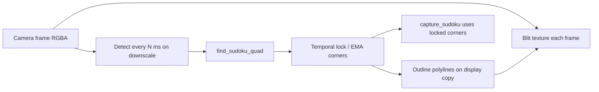

# Vision and camera optimization plan

## Goals

- Make live highlight cheap enough for smooth preview (stop full-res CV + alpha blend every frame).
- Stop accepting large non-sudoku rectangles that poison digit recognition.
- Make preview highlight and capture/`read_sudoku` use the same locked corners.

## Target architecture

Core API change in `[core/vision.py](core/vision.py)`: extract detection from highlight/read paths into one function, e.g. `find_sudoku_quad(img) -> np.ndarray | None` (4 corners in full-res image coords). `try_draw_sudoku_highlight` and `read_sudoku` both call it; camera keeps the last locked corners for capture.

Constants (detect width ~480, area fraction 0.15–0.85, aspect 0.85–1.15, detect interval, lock frames) live as module-level tunables in `vision.py` / `camera.py` — no `config.json` schema change in this pass.

## Phase 1 — Performance (preview path)

Files: `[core/vision.py](core/vision.py)`, `[widgets/camera.py](widgets/camera.py)`

1. **Downscale detection** — done
  Resize to ~480 px wide before preprocess/contours; scale corners back via `find_sudoku_contour`.
2. **Throttle detection in `KivyCamera`** — done
  Preview every frame; `find_sudoku_contour` at 8 Hz (`_DETECT_INTERVAL_S`); reuse `_last_contour` for overlay between detections.
3. **Outline-only live overlay** — code toggle
  Keep fill by default (`_HIGHLIGHT_FILL = True`, alpha `0.25`). Set `_HIGHLIGHT_FILL = False` in `widgets/camera.py` for outline-only (skips full-frame mask + `addWeighted`).
4. **Reuse Kivy texture** — done
  Create `Texture` once in `_ensure_preview_texture` (recreate only on size change); each frame only flip + `blit_buffer` + `canvas.ask_update()`.
5. **Stop unconditional full-frame copy for CV**
  Detect on a downscaled array; only copy the display frame when drawing an overlay.

Expected result: highlight cost drops enough that preview stays responsive without a background thread. (No worker thread in this plan — revisit only if Phase 1 is still too slow on device.)

## Phase 2 — Detection accuracy

File: `[core/vision.py](core/vision.py)` (mainly `largest_contour_area` → richer finder)

1. **Shared `find_sudoku_quad`** — done
  Centralize preprocess → contours → candidate filter → best pick as `find_sudoku_quad`. Fixed `reorder_points` docstring to TL, TR, BL, BR.
2. **Tighter geometric priors** (reject early)
  - Area between ~15% and ~85% of frame (or of downscaled frame, consistently)  
  - Aspect ratio ≈ 1.0 (e.g. 0.85–1.15)  
  - Convex quad; prefer non-border-hugging corners when possible  
   Replace/remove the weak `bb_filled` diagonal heuristic.
3. **Multi-candidate + grid score**
  Keep top-N area quads that pass geometry. For each: warp to a small square (e.g. 180–270 px), score grid-likeness (morphological horizontal/vertical line extract or Hough; reward ~8–10 strong lines each way / lattice energy). Return the best score above a threshold, else `None`.
4. **Light morphology on the binary image**
  Small close/open after adaptive threshold so noise furniture blobs are less likely to become quads before scoring.
5. **Wire `read_sudoku` through the same finder**
  Warp + cell split + model predict unchanged; only the corner source improves.

## Phase 3 — Temporal lock and capture UX

Files: `[widgets/camera.py](widgets/camera.py)`, `[screens/camera_screen.py](screens/camera_screen.py)`, `[core/vision.py](core/vision.py)`

1. **Corner smoothing / lock in `KivyCamera`**
  Store `locked_corners` (and optionally EMA). Accept a new detection only if close to previous (corner distance / IoU) or after N consecutive agreeing frames. Clear lock after M misses.
2. **Persist frame + corners for capture**
  Replace the current “only set `self.img` when detection succeeds” stale-frame behavior with explicit state: latest display frame always available; capture uses **locked** corners when present.
3. **Gate capture**
  In `capture_sudoku`, require lock (and optionally stability for N frames). Optionally add `read_sudoku_from_corners(img, corners)` so recognition uses the same quad the user saw highlighted.
4. **Optional UX**
  Disable or no-op capture when unlocked (logger / no navigation) so bad crops are not saved as frequently.

## Out of scope (this work)

- Digit model / `cell_pre_processing` changes  
- Background CV thread  
- New unit test suite (none exists today); validate manually with IP webcam + saved photos under `SudokuPhotos/`  
- Extending `[core/config.py](core/config.py)` / `config.json`

## Manual verification

- Preview stays smooth at 720p with highlight on.  
- Highlight prefers the printed grid over larger paper/table rectangles.  
- Moving the phone: highlight tracks without jumping to random quads.  
- Capture with lock produces a clean 9×9; capture without lock does nothing (or clearly fails).  
- Existing Android + IP webcam paths still start/stop cleanly.

